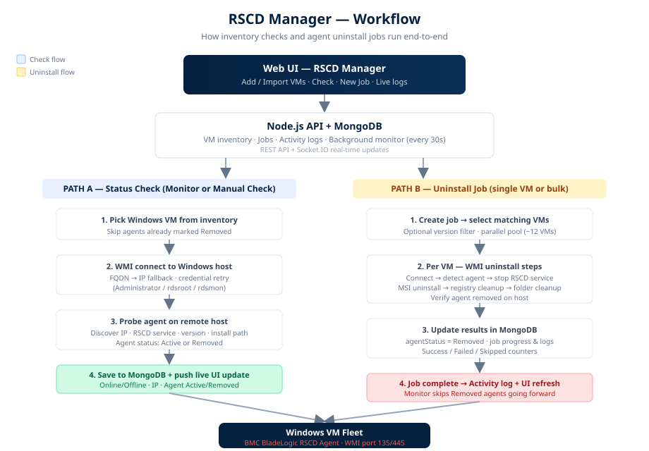

# RSCD Manager — Workflow



## Simple overview

```
Admin (Browser)
      │
      ▼
┌─────────────────┐
│  RSCD Manager   │  Add / Import · Check · Jobs · Logs
│     Web UI      │
└────────┬────────┘
         │ REST + Socket.IO
         ▼
┌─────────────────┐
│ Backend + DB    │  MongoDB inventory · Jobs · Activity log
│  (Node.js)      │  Background monitor every 30s
└────────┬────────┘
         │ WMI (ports 135 / 445)
         ▼
┌─────────────────┐
│  Windows VMs    │  BMC BladeLogic RSCD Agent
└─────────────────┘
```

## Path A — Status check (monitor or manual)

| Step | What happens |
|------|----------------|
| 1 | Pick a Windows VM from inventory (monitor skips **Removed** agents) |
| 2 | Connect via **WMI** — tries FQDN then IP, with credential fallback |
| 3 | Run remote probe — discover IP, RSCD service, version, install path |
| 4 | Update MongoDB — connectivity (online/offline), agent status (active/removed) |
| 5 | Push live update to UI via Socket.IO |

**Triggers:** background monitor (every 30s), **Check** on a row, or **Check All**.

## Path B — Uninstall job

| Step | What happens |
|------|----------------|
| 1 | Operator creates a job (all VMs, version filter, or single VM uninstall) |
| 2 | Backend runs VMs in parallel (~12 at a time) |
| 3 | Per VM via WMI: connect → detect → stop service → MSI uninstall → cleanup → verify |
| 4 | On success: `agentStatus = removed` in MongoDB |
| 5 | Job progress, per-VM logs, and final stats stream to the UI |

**Result:** removed agents show **Removed** (green). Future monitor cycles skip them unless you run a manual **Check**.

## Credentials & connectivity

- **WMI only** — no SSH, RDP, or WinRM required for operations
- Credential order: per-VM override → global list (`Administrator`, `rdsroot`, `rdsmon`)
- Hostname expansion: short names try DNS suffixes (e.g. `corp.helixops.ai`)
